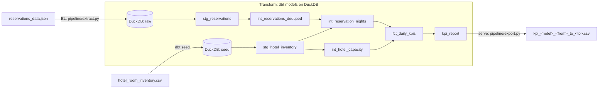

# RoomPriceGenie: Daily Hotel Performance KPIs

A small but production-shaped data pipeline that turns raw Odyssey PMS
reservation events into trustworthy daily performance KPIs (occupancy, net
revenue, ADR) and exports them as a CSV in the agreed contract format.

It is built as an **ELT pipeline**: a thin Python Extract/Load step lands the
raw JSON in **DuckDB**, **dbt** runs the Transform across layered models, and a
thin Python serve step exports the final CSV.

> **New to this repo?** Start here, then read [`docs/ARCHITECTURE.md`](docs/ARCHITECTURE.md)
> for the design and [`docs/METHODOLOGY.md`](docs/METHODOLOGY.md) for the exact
> KPI rules and worked examples.

---

## The deliverable

The required output (hotel `1035`, May 2026) is pre-generated and committed:

```
output/kpi_1035_2026_05_01_to_2026_05_31.csv
```

You do not need to run anything to see it. Everything below is for reproducing
it and understanding the design.

---

## Quickstart

Requirements: Python 3.10 or newer (built and verified on 3.11, 3.12 and 3.13).

```bash
# 1. Create an environment and install dependencies
python3 -m venv .venv
source .venv/bin/activate
pip install -r requirements.txt

# 2. Run the pipeline (defaults to hotel 1035, May 2026)
python run_pipeline.py
# -> writes output/kpi_1035_2026_05_01_to_2026_05_31.csv
```

A `Makefile` wraps the common tasks:

```bash
make install     # create venv and install runtime + dev dependencies
make run         # run the pipeline with defaults
make test        # dbt build (incl. dbt tests) + pytest + reconciliation
make lint        # ruff + sqlfluff
make check       # lint + test (what CI runs)
```

### Running for any hotel or date range

The pipeline accepts `hotel_id`, `from_date`, and `to_date`:

```bash
python run_pipeline.py \
    --hotel-id 1036 \
    --from-date 2026-04-01 \
    --to-date   2026-04-30
# -> output/kpi_1036_2026_04_01_to_2026_04_30.csv
```

| Argument        | Default                       | Meaning                                  |
| --------------- | ----------------------------- | ---------------------------------------- |
| `--hotel-id`    | `1035`                        | Hotel to report on                       |
| `--from-date`   | `2026-05-01`                  | Start of range (inclusive), `YYYY-MM-DD` |
| `--to-date`     | `2026-05-31`                  | End of range (inclusive), `YYYY-MM-DD`   |
| `--input`       | `data/reservations_data.json` | Raw PMS JSON                             |
| `--output-dir`  | `output/`                     | Where to write the CSV                   |

### Verifying correctness

An independent, dependency-free reimplementation recomputes the KPIs from the
raw JSON and compares them row by row with the pipeline's CSV:

```bash
python scripts/cross_check.py --csv output/kpi_1035_2026_05_01_to_2026_05_31.csv
# -> OK: independent reimplementation matches the pipeline output on every row.
```

---

## Architecture at a glance

Three stages, with a clear separation between *moving* data (Python) and
*transforming* data (SQL/dbt). Full detail in
[`docs/ARCHITECTURE.md`](docs/ARCHITECTURE.md).



| Stage           | Code                  | Responsibility                                           |
| --------------- | --------------------- | ------------------------------------------------------- |
| Extract / Load  | `pipeline/extract.py` | Read PMS JSON as text (schema-on-read) and land it raw  |
| Transform       | `dbt/rpg_kpi/`        | Cast, validate, deduplicate, explode, filter, aggregate |
| Serve / Export  | `pipeline/export.py`  | Copy the `kpi_report` mart to a contract-named CSV       |
| Orchestration   | `run_pipeline.py`     | Run the three stages and forward CLI args to dbt        |

---

## KPIs and the rules that matter

Output columns (sorted by `NIGHT_OF_STAY` descending), one row per night in the
requested range:

| Column                 | Definition                                                                 |
| ---------------------- | -------------------------------------------------------------------------- |
| `NIGHT_OF_STAY`        | The date (`YYYY-MM-DD`) the KPIs describe                                   |
| `OCCUPANCY_PERCENTAGE` | `occupied_rooms / hotel_capacity * 100`, 2 dp; can exceed 100 (overbooking)  |
| `TOTAL_NET_REVENUE`    | `room_net + fnb_net`, 2 dp                                                  |
| `ADR`                  | `total_net_revenue / occupied_rooms`, nearest integer; `0` if no rooms occupied |

Two rules decide whether this challenge is right or wrong. Both are covered by
[dbt unit tests](dbt/rpg_kpi/models) and the reconciliation script:

1. **Deduplicate before you aggregate.** The PMS re-sends a full snapshot every
   time a reservation changes, so `reservation_id` repeats in the raw feed (up to
   17 times here; 7,818 raw rows for hotel 1035 collapse to 3,468 real
   reservations). Only the latest valid snapshot per reservation is kept, and
   this happens *before* exploding nights or summing money.
2. **Occupancy and revenue use different status rules, by design.** Occupancy
   counts every status except `cancelled`; revenue includes every status,
   including `cancelled`. This asymmetry is taken verbatim from the brief. In the
   May 2026 output, `2026-05-26` shows revenue of `1908.36` at `0.00` occupancy
   with `ADR = 0`: a night whose only bookings were cancelled.

The other rules (a reservation is one room, inventory-only room types, occupiable
nights `[arrival, departure - 1]`, two-grain validation) are documented in
[`docs/METHODOLOGY.md`](docs/METHODOLOGY.md).

---

## Quality, tests and CI

The brief lists tests and CI as out of scope. They are included here, kept
deliberately lean, to show how the work is actually built and kept trustworthy.

- **dbt tests**: schema tests (`not_null`, `accepted_values`, uniqueness on the
  fact grain, relationships to inventory), singular tests for business
  invariants (no negative occupancy, ADR is 0 exactly when no rooms are
  occupied), and **dbt unit tests** that assert the dedup and KPI logic against
  small mocked inputs.
- **pytest** for the Python layer (validation helpers, rounding, filename
  convention, CLI argument handling) in `tests/`.
- **Reconciliation** (`scripts/cross_check.py`): a second, independent
  implementation that must agree with the pipeline on every row.
- **GitHub Actions** (`.github/workflows/ci.yml`): lint, run the full pipeline,
  `dbt build` (models + tests), pytest, reconciliation, and a regression check
  that the committed CSV still matches a freshly generated one.

Run the same checks locally with `make check`.

---

## Project structure

```
rpg-data-challenge/
├── run_pipeline.py              # CLI: EL -> dbt -> export
├── pipeline/
│   ├── extract.py               # EL: raw JSON -> DuckDB (schema-on-read)
│   └── export.py                # serve: kpi_report -> contract CSV
├── dbt/rpg_kpi/
│   ├── dbt_project.yml
│   ├── profiles.yml             # local DuckDB profile
│   ├── seeds/hotel_room_inventory.csv
│   ├── tests/                   # singular (business-invariant) tests
│   └── models/
│       ├── staging/             # stg_reservations, stg_hotel_inventory (+ tests)
│       ├── intermediate/        # dedup, nights, capacity (+ unit tests)
│       └── marts/               # fct_daily_kpis, kpi_report (+ tests)
├── scripts/cross_check.py       # independent KPI reconciliation
├── tests/                       # pytest suite for the Python layer
├── data/                        # provided inputs (committed for reproducibility)
├── output/                      # generated CSV deliverable
├── docs/
│   ├── ARCHITECTURE.md          # components, data flow, decisions, production
│   ├── METHODOLOGY.md           # exact KPI rules, validation, worked examples
│   └── coding_challenge_data_engineer.md   # the original brief
├── .github/workflows/ci.yml     # continuous integration
├── Makefile
├── pyproject.toml               # ruff + pytest config
├── .sqlfluff                    # SQL lint config (dbt templater)
├── requirements.txt             # runtime dependencies (pinned)
└── requirements-dev.txt         # lint + test dependencies
```

## From local to production

DuckDB and the file-based flow are deliberate development choices. The dbt model
layers, the ELT shape, and the contracts all port directly to a warehouse like
Snowflake with Dagster orchestration. The migration path and scaling notes (for
example handling millions of reservations per day, and the physical data layout:
partitioning, clustering keys, and indexing) are in
[`docs/ARCHITECTURE.md`](docs/ARCHITECTURE.md#from-local-to-production).
