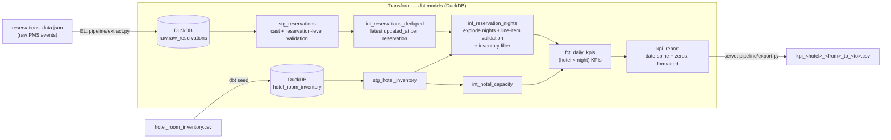

# RoomPriceGenie — Daily Hotel Performance KPIs

A small but production-shaped data pipeline that turns raw Odyssey PMS
reservation events into trustworthy **daily performance KPIs** (occupancy, net
revenue, ADR) and exports them as a CSV in the agreed contract format.

Built as an **ELT pipeline**: a thin Python **E**xtract/**L**oad step lands the
raw JSON in **DuckDB**, **dbt** does the **T**ransform across layered models, and
a thin Python serve step exports the final CSV.

---

## The deliverable

The required output — **hotel 1035, May 2026** — is pre-generated and committed:

```
output/kpi_1035_2026_05_01_to_2026_05_31.csv
```

You do **not** need to run anything to see it. Everything below is for
reproducing it and for understanding the design.

---

## Quickstart

Requirements: Python 3.10+ (built and verified on 3.13).

```bash
# 1. Create an environment and install dependencies
python3 -m venv .venv
source .venv/bin/activate
pip install -r requirements.txt

# 2. Run the pipeline (defaults to hotel 1035, May 2026)
python run_pipeline.py

# -> writes output/kpi_1035_2026_05_01_to_2026_05_31.csv
```

### Running for any hotel / date range

The pipeline accepts `hotel_id`, `from_date`, and `to_date`:

```bash
python run_pipeline.py \
    --hotel-id 1036 \
    --from-date 2026-04-01 \
    --to-date   2026-04-30
# -> output/kpi_1036_2026_04_01_to_2026_04_30.csv
```

| Argument        | Default        | Meaning                                    |
| --------------- | -------------- | ------------------------------------------ |
| `--hotel-id`    | `1035`         | Hotel to report on                         |
| `--from-date`   | `2026-05-01`   | Start of range (inclusive), `YYYY-MM-DD`   |
| `--to-date`     | `2026-05-31`   | End of range (inclusive), `YYYY-MM-DD`     |
| `--input`       | `data/reservations_data.json` | Raw PMS JSON               |
| `--output-dir`  | `output/`      | Where to write the CSV                      |

### Optional: verify correctness

An independent, dependency-free reimplementation recomputes the KPIs from the
raw JSON and compares them row-by-row with the pipeline's CSV:

```bash
python scripts/cross_check.py --csv output/kpi_1035_2026_05_01_to_2026_05_31.csv
# -> OK: independent reimplementation matches the pipeline output on every row.
```

---

## Architecture

The pipeline has three stages and a clear separation between *moving* data
(Python) and *transforming* data (SQL/dbt).



<details>
<summary>Plain-text version of the diagram</summary>

```
reservations_data.json ──(EL: extract.py)──► DuckDB: raw.raw_reservations
hotel_room_inventory.csv ──(dbt seed)──────► DuckDB: hotel_room_inventory

dbt transform (DuckDB):
  raw.raw_reservations ─► stg_reservations  (cast + reservation validation)
                          └─► int_reservations_deduped  (latest updated_at)
                              └─► int_reservation_nights (explode + line-item
                                   validation + inventory filter)
  hotel_room_inventory ─► stg_hotel_inventory ─► int_hotel_capacity
  int_reservation_nights + int_hotel_capacity ─► fct_daily_kpis (hotel × night)
                                                  └─► kpi_report (spine + zeros)

kpi_report ──(serve: export.py)──► kpi_<hotel>_<from>_to_<to>.csv
```
</details>

### Components & data flow

| Stage | Code | What it does | Where data lives |
| ----- | ---- | ------------ | ---------------- |
| **Extract / Load** | `pipeline/extract.py` | Reads the PMS JSON with an explicit all-`VARCHAR` schema, preserving the nested `stay_dates` array, and lands it untouched. | DuckDB table `raw.raw_reservations` |
| **Transform** | `dbt/rpg_kpi/` | Casts, validates, deduplicates, explodes nights, filters to inventory, and aggregates KPIs across layered models. | DuckDB schema `main` (views + tables) |
| **Serve / Export** | `pipeline/export.py` | Copies the `kpi_report` mart to a CSV named per the contract. | `output/*.csv` |
| **Orchestration** | `run_pipeline.py` | Runs the three stages in order and forwards CLI args to dbt as vars. | — |

Intermediate data is stored in a single local **DuckDB database file**
(`dbt/rpg_kpi/rpg.duckdb`, git-ignored, regenerated on every run). Staging and
intermediate models are **views** (cheap, always fresh); the marts are
materialized as **tables**.

### dbt model layers

| Layer | Model | Responsibility |
| ----- | ----- | -------------- |
| staging | `stg_reservations` | Cast text → typed; flag **reservation-level** contract validity. |
| staging | `stg_hotel_inventory` | Clean the inventory seed (authoritative room types & capacity). |
| intermediate | `int_reservations_deduped` | **Collapse event history to the latest valid snapshot per reservation.** |
| intermediate | `int_reservation_nights` | Explode stay-dates → nights; **line-item** validation; inventory filter; one room-night per reservation per night. |
| intermediate | `int_hotel_capacity` | Total sellable rooms per hotel (occupancy denominator). |
| mart | `fct_daily_kpis` | Reusable fact: KPIs at `(hotel_id, night)` for all activity. |
| mart | `kpi_report` | The served contract: date-spine over the request range, zeros for gaps, exact columns/formatting/order. |

---

## KPIs & business rules

Output columns (sorted by `NIGHT_OF_STAY` **descending**), one row per night in
the requested range:

| Column | Definition |
| ------ | ---------- |
| `NIGHT_OF_STAY` | The date (`YYYY-MM-DD`) the KPIs describe. |
| `OCCUPANCY_PERCENTAGE` | `occupied_rooms / hotel_capacity × 100`, 2 dp. Can exceed 100 (overbooking). |
| `TOTAL_NET_REVENUE` | `room_net + fnb_net`, 2 dp. |
| `ADR` | `total_net_revenue / occupied_rooms`, nearest integer; `0` if no rooms occupied. |

Five rules drive correctness. The first two are where this challenge is
genuinely won or lost:

1. **Deduplicate before you aggregate.** The PMS re-sends a full snapshot every
   time a reservation changes, so `reservation_id` repeats in the raw feed (up to
   **17×** here; 7,818 raw rows for hotel 1035 collapse to **3,468** real
   reservations). We keep only **the latest valid snapshot per reservation**
   (greatest `updated_at`) *before* exploding nights or summing money. Skipping
   this — or doing it after the explode — massively inflates both occupancy and
   revenue. This happens in `int_reservations_deduped`.

2. **Occupancy and revenue have different status rules (by design).**
   - Occupancy counts every status **except `cancelled`**.
   - Revenue includes **every status, including `cancelled`**.
   This asymmetry is taken verbatim from the brief. A real consequence in the
   May 2026 output: **2026-05-26** shows `TOTAL_NET_REVENUE = 1908.36` with
   `OCCUPANCY_PERCENTAGE = 0.00` and `ADR = 0` — a night whose only bookings were
   cancelled. (See "Assumptions" for why this is implemented literally.)

3. **A reservation is one room.** Each reservation contributes at most one
   occupied room per night, so we reduce to distinct nights per reservation.

4. **Only inventory room types count.** Reservations for room types absent from
   `hotel_room_inventory.csv` are ignored for *all* KPIs (e.g. room type `AD`,
   240 line items, and a `null` room type are excluded for hotel 1035).

5. **Occupiable nights only.** A guest occupies nights
   `[arrival_date, departure_date - 1]`; `departure_date` (checkout) is never an
   occupied night. Stay-date ranges (`start_date`→`end_date`) are expanded to
   individual nights and clamped to this window.

---

## Data validation (contract enforcement)

> The PMS does not always send data that conforms to the contract. Any
> individual entry that violates the contract is discarded — validation is split
> into two grains so a bad line item never sinks a whole reservation, and a bad
> reservation never sinks a whole feed.

**Reservation-level** (`stg_reservations` → drops the whole event):
`hotel_id` & `reservation_id` present; `status` ∈
{`confirmed`,`cancelled`,`checked_in`,`checked_out`}; `arrival_date`,
`departure_date` parseable with `departure > arrival`; `created_at`/`updated_at`
parseable; at least one stay-date.

**Line-item / stay-date level** (`int_reservation_nights` → drops just that
entry): `room_type_id` present; required revenue amounts present and numeric;
optional F&B amounts numeric *if present*; dates parseable with
`start ≤ end`, and the range inside the reservation period.

What this actually catches in the provided dataset (hotel 1035):

| Issue | Count | Action |
| ----- | ----- | ------ |
| Typo'd status `chcked_outs` | 1 | reservation discarded |
| `departure_date ≤ arrival_date` | 1 | reservation discarded |
| Room type not in inventory (`AD`, `null`) | 241 line items | line items dropped |
| Stay-date outside reservation period | 1 | line item dropped |
| Duplicate reservation snapshots | 4,350 | collapsed to latest |

---

## Key design decisions

- **ELT, not ETL.** We land the raw JSON first (cheap, replayable, a faithful
  copy) and transform inside the warehouse with set-based SQL. This is how the
  real RoomPriceGenie stack works, it keeps extraction dumb and idempotent, and
  it means re-deriving a metric is a `dbt run`, not a re-extract.

- **dbt + DuckDB.** DuckDB is a zero-setup, in-process analytical engine — ideal
  for a local, reproducible challenge — and dbt gives layered, documented,
  testable models with lineage. The model layers map 1:1 onto a warehouse like
  Snowflake (see *From local to production*). DuckDB is intentionally a
  development choice, not a production recommendation.

- **Schema-on-read at the boundary.** Everything lands as `VARCHAR` and is cast
  in SQL with `TRY_CAST`, so malformed values are *detected and discarded* by the
  pipeline rather than silently coerced (or rejected) by the JSON reader.

- **Two marts, separated concerns.** `fct_daily_kpis` is a reusable fact (all
  hotels, all active nights). `kpi_report` is the *serving* layer that applies a
  request's date-spine, zero-filling, formatting, and ordering. The fact can feed
  many reports; the report is cheap to re-run per request.

- **Deterministic & idempotent.** Re-running with the same inputs reproduces the
  same DuckDB and the same CSV (the dedup tie-break is deterministic).

---

## Assumptions

- **Cancelled-revenue asymmetry is intentional.** The brief explicitly says
  occupancy excludes `cancelled` while revenue includes "any status". I
  implemented it literally (cancelled bookings contribute revenue but not
  occupied rooms; ADR therefore divides revenue-including-cancelled by
  rooms-excluding-cancelled). This is ~14% of May 2026 revenue, so it materially
  matters; it is implemented as written rather than "tidied up".
- **"Last valid one" = greatest `updated_at`.** Validity is decided first, then
  the latest surviving snapshot per `reservation_id` wins. Identical snapshots
  sharing an `updated_at` are tie-broken deterministically (their data is
  identical, so the choice is immaterial).
- **`departure_date` is checkout**, so the last occupied night is
  `departure_date - 1`.
- **Grouped stay-date ranges carry per-night amounts.** When the PMS groups
  consecutive identical nights into one entry, the revenue figures are per night
  and applied to each expanded night (not divided across the range), per the
  contract's grouping note.
- **Capacity = sum of inventory quantities** for the hotel (1035 → 14 rooms).
- **One PMS request contains all hotels**, per the brief's simplification.

---

## From local to production (technical deep-dive notes)

What I would change to take this to production at RoomPriceGenie scale:

- **Warehouse: DuckDB → Snowflake.** The dbt models port directly (mostly
  ANSI-ish SQL; the few DuckDB idioms — `unnest`, `range`, `read_json` — have
  Snowflake equivalents: `LATERAL FLATTEN`, generators, `VARIANT`/`COPY INTO`).
  Staging→intermediate→marts and the ELT shape stay the same.
- **Ingestion.** Replace file-read with paginated API extraction landing raw
  `VARIANT`/JSON into a Snowflake landing table (or object storage + external
  tables / Snowpipe), partitioned by load date — keeping raw immutable for
  replay.
- **Orchestration: Dagster.** Each stage becomes an asset (raw load → dbt assets
  → export) with schedules, retries, backfills, and freshness checks — no bespoke
  Python runner.
- **Scale (e.g. 3M reservations/day).** Make `fct_daily_kpis` an **incremental**
  model partitioned/clustered by night; reprocess only affected partitions. Do
  the snapshot-dedup with windowed `QUALIFY` (or `dbt snapshot` for true CDC
  history). The night-explosion is the main fan-out to watch — cap stay lengths,
  and aggregate early to keep state small.
- **Data quality as a gate.** Promote the informal checks into dbt tests
  (`not_null`, `accepted_values` on status, `relationships` to inventory,
  uniqueness on `(hotel_id, night)`) plus reconciliation/freshness, wired into CI
  so bad data fails the build instead of reaching the dashboard.
- **Serving.** Expose the fact to the reporting/pricing teams via a stable,
  versioned contract (a published mart or a thin API) rather than CSV files.

---

## Project structure

```
rpg-data-challenge/
├── run_pipeline.py              # CLI: EL -> dbt -> export
├── pipeline/
│   ├── extract.py               # EL: raw JSON -> DuckDB (schema-on-read)
│   └── export.py                # serve: kpi_report -> contract CSV
├── dbt/rpg_kpi/
│   ├── dbt_project.yml
│   ├── profiles.yml             # local DuckDB profile
│   ├── seeds/hotel_room_inventory.csv
│   └── models/
│       ├── staging/             # stg_reservations, stg_hotel_inventory
│       ├── intermediate/        # dedup, nights, capacity
│       └── marts/               # fct_daily_kpis, kpi_report
├── scripts/cross_check.py       # independent KPI reconciliation
├── data/                        # provided inputs (committed for reproducibility)
├── output/                      # generated CSV deliverable
└── docs/coding_challenge_data_engineer.md   # the original brief
```

## Out of scope (by direction of the brief)

No Docker, orchestration, CI/CD, or a unit-test suite — these were explicitly
not required. The focus is correct KPIs, a clean and well-organized pipeline, and
clearly explained architecture. (`scripts/cross_check.py` is a reconciliation
aid, not a test framework.)
