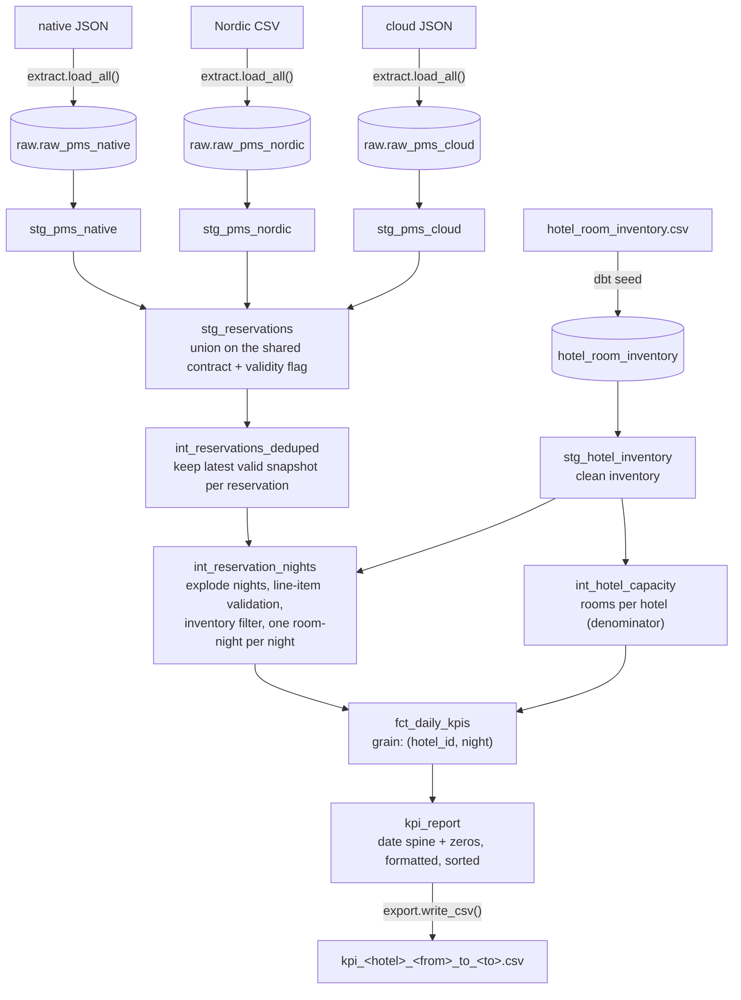

# Architecture

This document describes the architecture of what is actually implemented in this
repository: the components, how data flows from input to output, where
intermediate data lives, and the decisions behind the design. The KPI rules
themselves are in [`METHODOLOGY.md`](METHODOLOGY.md).

## Overview

The pipeline is an **ELT** pipeline with three stages:

1. **Extract / Load (Python).** Land each raw PMS source into its own DuckDB
   table, untouched.
2. **Transform (dbt on DuckDB).** Normalize each source onto a shared contract
   (per-source adapters), union them, then cast, validate, deduplicate, explode
   to nights, filter to inventory, and aggregate KPIs across layered models.
3. **Serve / Export (Python).** Copy the final serving model to a CSV named per
   the contract.

The pipeline ingests three PMS sources with different shapes and normalizes them
through an adapter layer. The multi-source design (schema differences, the
adapter pattern, per-source examples) is documented in
[`PMS_SOURCES.md`](PMS_SOURCES.md); this document covers the shared pipeline
below.

A single Python entrypoint (`run_pipeline.py`) runs the three stages in order
and forwards the request parameters (`hotel_id`, `from_date`, `to_date`) to dbt
as variables.

## Data flow

### Stage 1: Extract / Load (`pipeline/extract.py`)

- Lands each PMS source into its own raw table with DuckDB's `read_json` /
  `read_csv`, declaring an explicit **all-`VARCHAR` schema** (including nested
  arrays of structs). `load_all()` reads whichever sources are present.
- Each raw table (`raw.raw_pms_native`, `raw.raw_pms_nordic`,
  `raw.raw_pms_cloud`) is one row per raw record, nested arrays preserved as
  native `LIST(STRUCT(...))`.
- No validation, casting, or business logic happens here. This is a faithful,
  replayable copy of each source. Reading everything as text is a deliberate
  schema-on-read choice so that malformed values are detected and discarded by
  the transform layer rather than silently coerced or rejected by the reader.

### Stage 2: Transform (`dbt/hotel_kpi/`)

dbt models, materialized in DuckDB, organised in three layers.

| Layer        | Model                       | Materialization | Responsibility                                                              |
| ------------ | --------------------------- | --------------- | -------------------------------------------------------------------------- |
| staging      | `stg_pms_native`            | view            | Adapter: normalize the native PMS feed onto the shared contract             |
| staging      | `stg_pms_nordic`            | view            | Adapter: normalize the Nordic PMS feed onto the shared contract             |
| staging      | `stg_pms_cloud`             | view            | Adapter: normalize the cloud PMS feed onto the shared contract              |
| staging      | `stg_reservations`          | view            | Union the adapters; flag reservation-level contract validity                |
| staging      | `stg_hotel_inventory`       | view            | Clean the inventory seed (authoritative room types and capacity)            |
| intermediate | `int_reservations_deduped`  | view            | Keep only valid events, then the latest snapshot per reservation            |
| intermediate | `int_reservation_nights`    | view            | Explode stay-dates to nights, line-item validation, inventory filter        |
| intermediate | `int_hotel_capacity`        | view            | Total sellable rooms per hotel (the occupancy denominator)                  |
| mart         | `fct_daily_kpis`            | table           | Reusable fact: KPIs at the grain `(hotel_id, night)` for all activity       |
| mart         | `kpi_report`                | table           | The served contract for one hotel and date range                           |

Staging and intermediate models are **views**: cheap, always reflecting the
current raw load. The marts are **tables**: the fact is the materialised, queried
artifact, and the report is a small table that the export step copies out.

### Stage 3: Serve / Export (`pipeline/export.py`)

- Copies `kpi_report` to a CSV via DuckDB `COPY`, with the contract column names,
  rounding, and descending sort already applied in the model.
- Names the file `kpi_<hotel_id>_<yyyy>_<mm>_<dd>_to_<yyyy>_<mm>_<dd>.csv`.

## Where intermediate data lives

Everything intermediate lives in a single local **DuckDB database file**
(`dbt/hotel_kpi/hotel_kpi.duckdb`). It is git-ignored and fully regenerated on every run,
so the repository never stores derived state. The path is configurable through
the `HOTEL_KPI_DUCKDB_PATH` environment variable, which `run_pipeline.py` sets so the EL
step and dbt share the same database file.

## Why two marts

`fct_daily_kpis` is a **request-agnostic fact**: it covers every hotel and every
night that has activity. `kpi_report` is the **serving layer** that applies one
request's concerns: a date spine over `[from_date, to_date]`, zero-filling for
nights with no data, the exact output columns and formatting, and the sort order.

This separation keeps the fact reusable (it can feed many reports or a BI tool),
keeps request-specific shaping out of the core model, and makes re-running a
single report cheap.

## Data-quality layer

Alongside the KPI marts sits a data-quality layer under
`models/marts/data_quality/` that answers the questions a revenue-management data
team asks before trusting a number: is the data recent (`data_freshness`), is it
all there (`data_availability`), does it add up (`reconciliation_report`), and how
did the property do against the market (`mart_kpi_with_market`). These models read
from `fct_daily_kpis` and the deduped reservations; they never change the served
`kpi_report`. Two small reference feeds back them, seeded from the deterministic
generator: `source_load_manifest` (per-source load times and freshness SLAs) and
`market_rate_index` (an illustrative external comp-set signal). Freshness is
measured against a fixed as-of watermark (the `as_of_watermark` var) so the build
stays deterministic. Full detail is in [`DATA_QUALITY.md`](DATA_QUALITY.md).

## Key design decisions

### ELT, not ETL

The raw JSON is landed first (cheap, replayable, a faithful copy) and transformed
inside the warehouse with set-based SQL. This matches how a real revenue-management platform
stack works, keeps extraction dumb and idempotent, and means re-deriving a metric
is a `dbt run` rather than a re-extract. With ETL, transformation logic would sit
in imperative Python before load, which is harder to test, harder to reason about
at the set level, and does not scale to a warehouse as cleanly.

### dbt + DuckDB

DuckDB is a zero-setup, in-process analytical engine, ideal for a local,
reproducible pipeline. dbt adds layered, documented, and testable models with
lineage. The two together give a project whose structure maps one-to-one onto a
production warehouse. DuckDB here is a development choice, not a production
recommendation (see below).

### Schema-on-read at the boundary

Everything lands as `VARCHAR` and is cast in SQL with `TRY_CAST`. Malformed values
become `NULL` and are caught by explicit validation rules, rather than causing the
JSON reader to fail the whole load or silently guess a type.

### Deterministic and idempotent

Re-running with the same inputs reproduces the same DuckDB database and the same
CSV. The deduplication tie-break (when two snapshots share an `updated_at`) is
deterministic, so output never depends on row ordering.

## From local to production

The following is what would change to run this at production scale. The dbt
model layers, the ELT shape, and the contracts stay the same.

- **Warehouse: DuckDB to Snowflake.** The models port directly. The few DuckDB
  idioms have Snowflake equivalents: `unnest` becomes `LATERAL FLATTEN`,
  `range(...)` becomes a generator or a date dimension, and `read_json` becomes
  `COPY INTO` a `VARIANT` landing column.
- **Ingestion.** Replace the file read with paginated API extraction that lands
  raw JSON or `VARIANT` into a landing table (or object storage plus external
  tables / Snowpipe), partitioned by load date, keeping raw immutable for replay.
- **Orchestration: Dagster.** Each stage becomes an asset (raw load, then dbt
  assets, then export) with schedules, retries, backfills, and freshness checks,
  replacing the bespoke Python runner.
- **Scale (for example millions of reservations per day).** Make `fct_daily_kpis`
  an incremental model partitioned or clustered by night and reprocess only the
  affected partitions. Resolve the snapshot deduplication with a windowed
  `QUALIFY`, or use `dbt snapshot` for true change-data-capture history. The
  night explosion is the main fan-out to watch: cap stay lengths and aggregate
  early to keep state small.
- **Data quality as a gate.** Promote the tests in this repo into the deployment
  pipeline so bad data fails the build instead of reaching the dashboard, and add
  freshness and reconciliation checks.
- **Serving.** Expose the fact to the reporting and pricing teams through a
  stable, versioned contract (a published mart or a thin API) rather than CSV
  files.

### Physical data layout: partitioning, clustering, and indexing

Physical design is about making the warehouse read as little data as possible
for the queries this workload actually runs (a dashboard sliced by hotel and
date range). Each engine has a different mechanism, so the right answer is
engine-specific.

**DuckDB (local).** No manual tuning is warranted. DuckDB keeps per-row-group
min/max zonemaps automatically, which already prune the date and hotel filters
on a single file. There are no indexes to maintain, and at this data size a full
scan is cheap regardless.

**Snowflake (production).** Snowflake has no B-tree indexes; the equivalent
levers are micro-partition pruning, clustering keys, and the Search Optimization
Service.

- **Micro-partitions and pruning.** Snowflake stores tables as immutable
  micro-partitions with per-column min/max metadata. A query that filters on a
  well-ordered column reads only the matching partitions. The aim of every choice
  below is to make that pruning effective.
- **Clustering key on the fact.** `fct_daily_kpis` is filtered by date range and
  hotel, so a clustering key of `(night)` (or `(night, hotel_id)`) co-locates each
  night's rows. Once the fact reaches billions of rows, a one-month dashboard
  query then scans a handful of partitions instead of the whole table. This is
  the Snowflake equivalent of "indexing for the query pattern".
- **Incremental build aligned to the cluster key.** Make `fct_daily_kpis`
  incremental and keyed by `night` so each run reprocesses only the affected
  dates. Clustering by the same `night` keeps the incremental `MERGE` localized
  and cheap, and avoids large reclustering churn.
- **Point lookups.** For occasional high-cardinality equality lookups (for
  example debugging a single `reservation_id`), the Search Optimization Service
  fits better than reshaping the table, since the table is optimized for
  date-ranged analytical scans, not point reads.
- **Landing partitioned by load date.** Keep the raw landing table partitioned by
  ingestion date so replays and late-arriving data touch a bounded set of
  partitions rather than the full history.
- **What to avoid.** Do not cluster on high-cardinality keys such as
  `reservation_id` on the fact, and do not cluster on many columns at once.
  Reclustering has a real cost, so cluster only on the columns the serving queries
  filter and join on (here, `night` first, then `hotel_id`).

The reasoning matters more than the specific keys: physical layout follows the
query pattern and the cost of maintaining it, and uses each engine's real
mechanism rather than a generic index.
