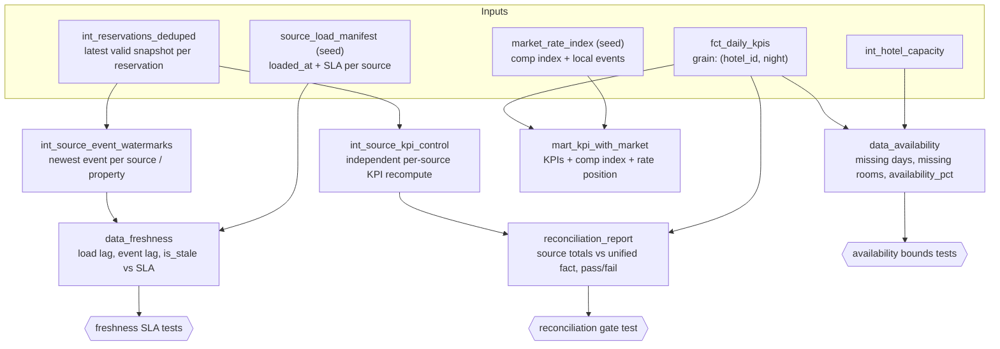

# Data-quality signals

Trustworthy KPIs need more than correct arithmetic. Before a revenue-management
team acts on occupancy or ADR, it wants to know three things about the data
behind the number: is it recent, is it all there, and does it add up. This
document covers the models that answer those questions, plus a light external
market signal blended onto the KPIs.

The core KPI rules live in [`METHODOLOGY.md`](METHODOLOGY.md); the shared
pipeline and multi-source design live in [`ARCHITECTURE.md`](ARCHITECTURE.md) and
[`PMS_SOURCES.md`](PMS_SOURCES.md). Everything here sits alongside the KPI fact
and reads from it; none of it changes the published `kpi_report` output.

All of these signals are computed against a fixed **as-of watermark**
(`2026-06-01 06:00:00`, the `as_of_watermark` dbt var) rather than wall-clock
`now()`, so every build is deterministic and reproducible.

## Flow



## 1. Freshness (`data_freshness`)

Freshness has two halves, and the model reports both:

- **Load side.** When did each source's latest batch land? This comes from
  `source_load_manifest`, a small seed with one row per PMS source giving its
  `loaded_at` timestamp and its `freshness_sla_hours`. `load_lag_hours` is the
  gap between that load and the as-of watermark.
- **Event side.** How recent is the newest *event* in the feed? A source can
  load on time yet still be stale if it stopped emitting. `int_source_event_watermarks`
  takes the maximum `updated_at` per source (and per property), and
  `event_lag_hours` measures the gap to the watermark (floored at 0).

The SLA verdict is `is_stale = load_lag_hours > freshness_sla_hours`. In the
shipped synthetic data the `cloud` source is deliberately left past its SLA (last
load 30h ago against a 24h SLA) so the freshness check has something real to
catch, while `native` and `nordic` are fresh.

Grain: one row per `(source_system, hotel_id)`, with `hotel_id = '__all__'` as
the source-level rollup.

**Tests**: `not_null` on every lag/SLA column; `is_stale` correctly derived from
the lag-vs-SLA comparison (`assert_freshness_sla_detects_stale`); one row per
grain (`assert_data_freshness_unique_grain`).

## 2. Availability / completeness (`data_availability`)

For each property the model builds the expected calendar (every night between
the property's first and last night of activity) and checks coverage against it:

- **Missing days.** `is_missing_day` is true for any night inside that window
  with no row in `fct_daily_kpis` at all: the feed skipped that date.
- **Missing room-nights.** `missing_room_nights` is capacity minus occupied
  rooms: room-nights we hold no occupied reservation for.
- **Availability percentage.** `availability_pct` is `occupied_rooms / capacity
  * 100`, capped at 100 so an oversold night still reads as fully covered.

Grain: one row per `(hotel_id, night)`.

**Tests**: `not_null` on keys and coverage columns; `availability_pct` bounded to
`[0, 100]` and capacity strictly positive (`assert_availability_pct_bounded`);
one row per grain (`assert_data_availability_unique_grain`).

## 3. Reconciliation (`reconciliation_report`)

The published fact (`fct_daily_kpis`) is source-agnostic. Reconciliation proves
the sources add up to it. `int_source_kpi_control` independently recomputes
occupied room-nights and net revenue per source, straight from the deduped
reservations and deliberately **not** reusing `int_reservation_nights`, so
agreeing with the fact is real evidence rather than a tautology.

The report lays out one row per source (its contribution) plus a `__total__`
row carrying the unified fact totals, the absolute differences, and the pass/fail
verdict `reconciled`. The revenue tolerance (0.01) absorbs floating-point
rounding only; any genuine discrepancy (dropped rows, double counting) breaks the
verdict.

**Tests**: `assert_reconciliation_passes` is the gate. It fails the build if the
`__total__` row does not reconcile. `assert_source_totals_sum_to_fact`
independently re-sums the per-source rows and confirms they match the fact totals.

## 4. Market blend (`mart_kpi_with_market`)

`market_rate_index` is a generic, illustrative external signal: a nightly comp-set
rate index per property (100 = the comp set priced at the property's own typical
rate) plus a local-events flag, following a fixed weekly-and-events shape. It
carries no real market data; it exists to show the pattern of blending an outside
source with internal reservation data.

`mart_kpi_with_market` left joins it onto `fct_daily_kpis`, so internal KPIs
always survive (the market columns are simply null where no market row exists),
and derives `rate_vs_market_index`, the property's own ADR expressed against the
comp index, as a simple rate-position read. Grain: one row per `(hotel_id,
night)`.

**Tests**: `not_null` on keys and the event flag; the market join must not fan
out the grain (`assert_mart_kpi_with_market_unique_grain`).

## Regenerating the inputs

The manifest and market index are deterministic, seeded outputs of
`scripts/generate_synthetic.py`, written both to `data/` and into
`dbt/hotel_kpi/seeds/`:

```bash
make gen-data   # regenerate all synthetic inputs (byte-identical each run)
```

CI regenerates them and fails on any diff, so the seeds cannot drift from the
generator.
