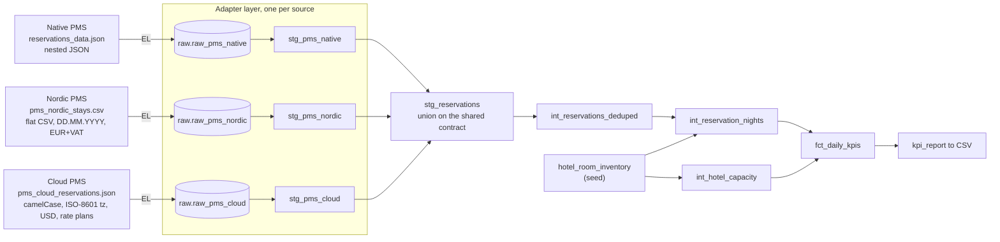

# Multiple PMS sources

The original pipeline ingested one PMS feed. Real revenue reporting rarely gets
that luxury: a hotel group runs different property management systems across its
properties, and each one exports data in its own shape. This document covers the
three PMS sources this repo ingests, how they differ, and the adapter pattern
that normalizes all of them onto one KPI model so nothing downstream has to know
where a reservation came from.

The KPI rules themselves do not change per source. What changes is the shape of
the input, and that is exactly what the adapter layer absorbs.

## The three sources

| Source | Property IDs | Format | Distinctive traits |
| ------ | ------------ | ------ | ------------------ |
| Native PMS (A) | `1035`, `1036` | Nested JSON, one object per reservation event | Snapshot revisions, `stay_dates` list, net and gross both provided |
| Nordic PMS (B) | `2050` | Flat CSV, one row per room-night | `DD.MM.YYYY` dates, gross-inclusive EUR with a VAT column, short status codes, no-shows, a retired room code |
| Cloud PMS (C) | `3120`, `3121` | Nested JSON, camelCase | ISO-8601 timestamps with a timezone offset, USD, rate plans and discounts, partial refunds, late check-outs, deliberate overbooking, two-property group |

Sources B and C are synthetic and generated by `scripts/generate_synthetic.py`
with a fixed seed, so the data is deterministic: regenerating produces
byte-identical files, and CI checks that. Source A is the original feed and is
not regenerated.

## What actually differs, field by field

The point of the three sources is that they differ in the ways real PMS feeds
differ, not in cosmetic ways. Here is the mapping each adapter has to perform.

| Concept | Native (A) | Nordic (B) | Cloud (C) |
| ------- | ---------- | ---------- | --------- |
| Property id | `hotel_id` | `property_code` | `propertyId` |
| Reservation id | `reservation_id` | `booking_ref` | `confirmationId` |
| Status | `confirmed` / `cancelled` / `checked_in` / `checked_out` | `OK` / `OUT` / `CXL` / `NOSHOW` | `confirmed` / `cancelled` / `checkedIn` / `checkedOut` |
| Dates | `YYYY-MM-DD` | `DD.MM.YYYY` | `YYYY-MM-DD` |
| Timestamps | `YYYY-MM-DD HH:MM:SS.sss` | none (synthesized) | ISO-8601 with tz offset (`...T09:00:00-05:00`) |
| Grain | one object, nested `stay_dates` | one row per room-night (pre-exploded) | one object, nested `nightlyRates` |
| Currency | provided net + gross | gross EUR, VAT-inclusive | net + gross USD (differ by discount) |
| Room net | `room_revenue_net_amount` | derived: `gross - VAT` | `roomChargeNet` |
| F&B net | `fnb_net_amount` | derived: `board_gross / (1 + VAT)` | `incidentalsNet` |
| Revisions | multiple snapshots per id | none | multiple snapshots per id |

A few of these are worth calling out:

- **Nordic sends money gross, VAT-inclusive.** The KPIs are net, so the adapter
  backs VAT out of the room price (`net = gross - VAT`) and out of board revenue
  (`board_net = board_gross / 1.10`). Getting this wrong inflates revenue by the
  VAT rate.
- **Nordic is already exploded to nights.** Every source else carries a stay as a
  range; Nordic sends one row per night. The adapter regroups those rows back
  into one reservation with a `stay_dates` list, so the downstream night
  explosion sees the same shape it always does.
- **Nordic has no revision timestamps.** It sends no change history, so the
  adapter synthesizes a stable `created_at` / `updated_at` from the arrival
  date. Dedup then runs and is a no-op for Nordic, which is correct.
- **Cloud rate plans mean gross and net differ by more than tax.** A `CORP` rate
  is 20 percent off rack before tax, so net is a real discount, not just a tax
  adjustment. The adapter carries the net through untouched; the discount is
  already baked into the numbers the source sends.
- **Cloud timestamps carry a timezone offset.** All cloud events share one
  offset and only relative ordering per reservation matters for dedup, so the
  adapter keeps the wall-clock value and drops the offset.

## The adapter pattern

Each source gets one staging model, `stg_pms_<source>`, whose only job is to map
that source onto a single shared contract:

- typed reservation-level columns: `hotel_id`, `reservation_id`, `status`,
  `arrival_date`, `departure_date`, `created_at`, `updated_at`,
- a `stay_dates` list of structs with shared field names (`room_type_id`,
  `start_date`, `end_date`, `room_gross`, `room_net`, `fnb_gross`, `fnb_net`),
- a `source_system` tag, and
- an `is_valid` reservation-level flag.

Validation is defined once, in the `reservation_validity()` macro, and every
adapter calls it. So a new source inherits the same contract checks for free; it
only has to map its fields correctly.

`stg_reservations` then unions the adapters:

```sql
select * from {{ ref('stg_pms_native') }}
union all by name
select * from {{ ref('stg_pms_nordic') }}
union all by name
select * from {{ ref('stg_pms_cloud') }}
```

Everything after that point (dedup, night explosion, the inventory filter,
capacity, the KPI fact, the report) is source-agnostic. It reads the unified
feed and never branches on which PMS a row came from.



## Adding a fourth PMS

The pattern makes adding a source a tidy, local change:

1. Add a reader in `pipeline/extract.py` that lands the file into
   `raw.raw_pms_<name>` (all VARCHAR, schema-on-read).
2. Declare the raw table in `models/staging/_sources.yml`.
3. Write `models/staging/stg_pms_<name>.sql` that maps the source onto the shared
   contract and calls `{{ reservation_validity() }}`.
4. Add one line to the union in `stg_reservations.sql`.
5. Add the new room types and capacity to `seeds/hotel_room_inventory.csv`.

Nothing in the intermediate or mart layers changes.

## Running each source

Every property runs through the same command; only the id and range change.

```bash
# Native PMS (the headline deliverable, hotel 1035)
python run_pipeline.py --hotel-id 1035 --from-date 2026-05-01 --to-date 2026-05-31

# Nordic PMS (property 2050)
python run_pipeline.py --hotel-id 2050 --from-date 2026-05-01 --to-date 2026-05-31

# Cloud PMS (properties 3120 and 3121)
python run_pipeline.py --hotel-id 3120 --from-date 2026-05-01 --to-date 2026-05-31
python run_pipeline.py --hotel-id 3121 --from-date 2026-05-01 --to-date 2026-05-31
```

Each run lands all three sources, builds the unified model once, and exports the
CSV for the requested property.

## Verifying each source

The independent reconciliation (`scripts/cross_check.py`) reimplements each
adapter in pure Python and recomputes the KPIs from the raw file, then compares
row by row with the pipeline CSV. Pick the source with `--source`:

```bash
python scripts/cross_check.py --source native \
    --csv output/kpi_1035_2026_05_01_to_2026_05_31.csv --hotel-id 1035
python scripts/cross_check.py --source nordic \
    --csv output/kpi_2050_2026_05_01_to_2026_05_31.csv --hotel-id 2050
python scripts/cross_check.py --source cloud \
    --csv output/kpi_3120_2026_05_01_to_2026_05_31.csv --hotel-id 3120
```

CI runs all four (native, Nordic, and both cloud properties) on every push.

## Example KPI outputs

Each source exercises the KPI rules through its own quirks.

**Native PMS (`1035`, May 2026).** The cancelled-revenue asymmetry is clearest
here. On `2026-05-26` revenue is `1908.36` at `0.00` occupancy with `ADR = 0`: a
night whose only bookings were cancelled, so revenue counts (all statuses) but no
room is occupied. Committed CSV: `output/kpi_1035_2026_05_01_to_2026_05_31.csv`.

**Nordic PMS (`2050`, May 2026).** VAT is backed out of every price, and no-shows
count for revenue and occupancy while cancellations count only for revenue.
Committed CSV: `output/kpi_2050_2026_05_01_to_2026_05_31.csv`.

| Night | Occupancy | Revenue | ADR |
| ----- | --------- | ------- | --- |
| `2026-05-30` | `86.67` | `2956.82` | `227` |
| `2026-05-27` | `80.00` | `3024.02` | `252` |
| `2026-05-25` | `66.67` | `3354.94` | `335` |

**Cloud PMS (`3120`, May 2026).** The group is deliberately oversold on
`2026-05-14`, so occupancy exceeds 100 percent. Rate-plan discounts and partial
refunds move the revenue and ADR. Committed CSV:
`output/kpi_3120_2026_05_01_to_2026_05_31.csv`.

| Night | Occupancy | Revenue | ADR | Note |
| ----- | --------- | ------- | --- | ---- |
| `2026-05-14` | `148.00` | `7185.30` | `194` | Overbooked, occupancy above 100 |
| `2026-05-15` | `28.00` | `1980.00` | `283` | A normal night |
| `2026-05-13` | `24.00` | `1643.40` | `274` | A normal night |
